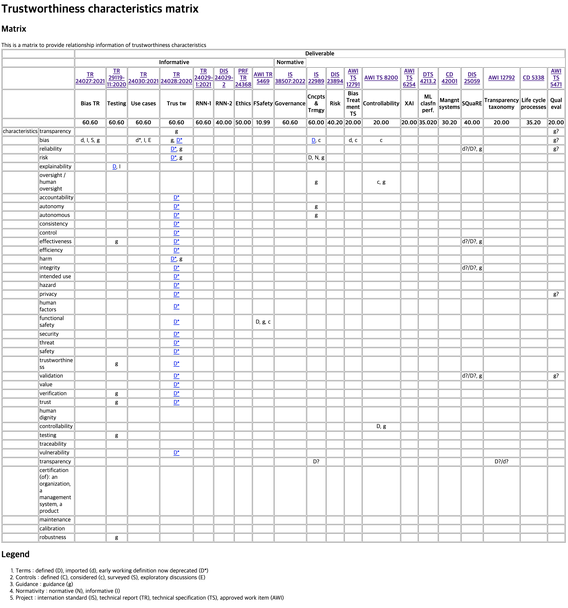

# AI/ML Trustworthiness characteristics matrix V5 (WIP)
## ISO/IEC JTC/1 SC42 WG3

This page was created for the purpose of collaboration in the roadmapping AHG of ISO/IEC JTC 1/SC 42/WG 3.

## Trustworthiness Characteristics Matrix

The Trustworthiness Characteristics Matrix (TCM) of this document was created with the purpose of arranging the relationship between trustworthiness-related characteristics in a situation where various AI/ML-related standards are being created within SC42.

TCM classifies the characteristics of trustworthiness in the specifications of SC42, and organizes the statements related to the characteristic. This matrix aims to clean up consistent what relationship is in there between the trustworthiness charateristics and standard.

* [TCM with menu style](http://hollobit.github.io/WG3_TCM/index.html)
* [TCM for print style](http://hollobit.github.io/WG3_TCM/index-nostyle.html)

          
## Contributing

Issues and Pull Requests are greatly appreciated. If you've never contributed to an open source project before I'm more than happy to walk you through how to create a pull request.

You can start by [opening an issue](https://github.com/hollobit/WG3_TCM/issues/new) describing the problem that you're looking to resolve and we'll go from there.

## License

This document is licensed under the [MIT license](https://opensource.org/licenses/mit-license.php) © Jonghong Jeon
